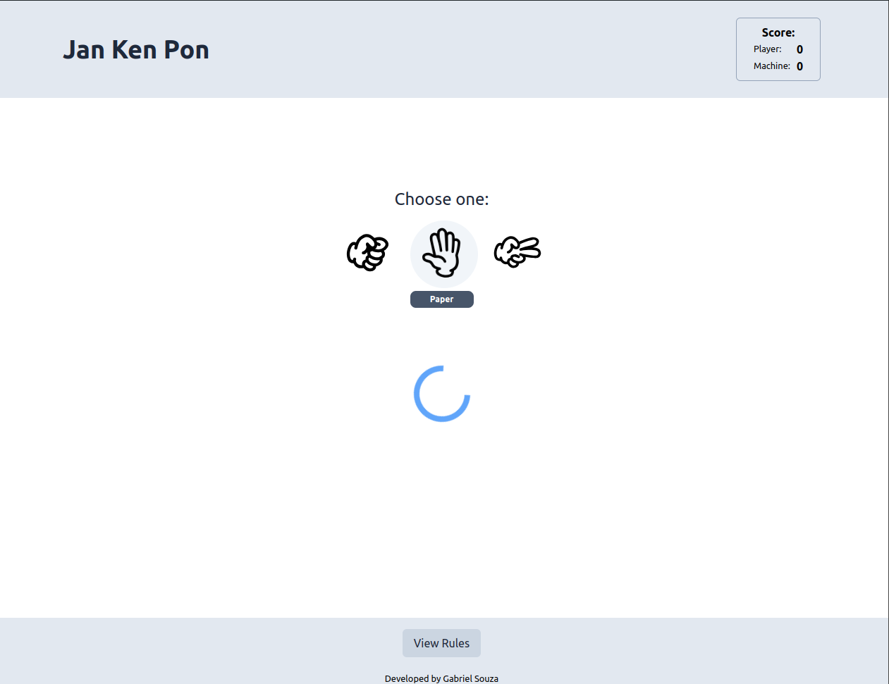
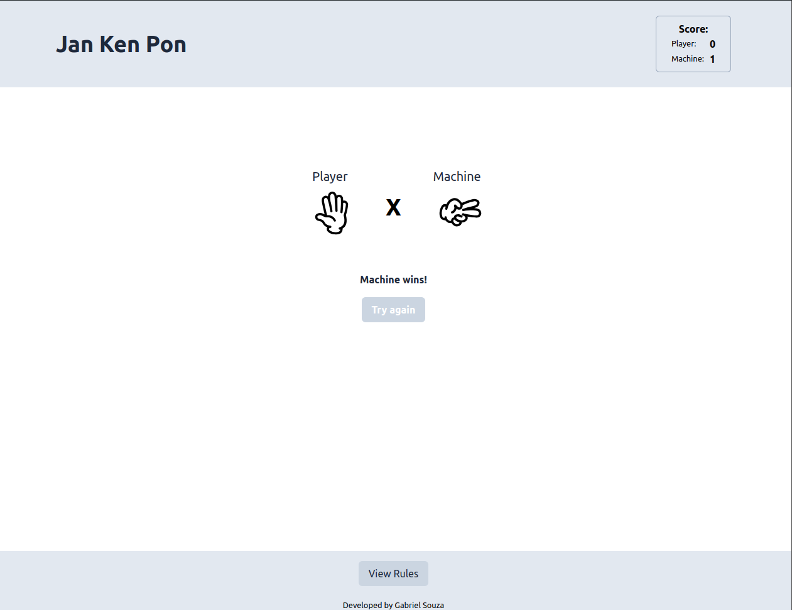
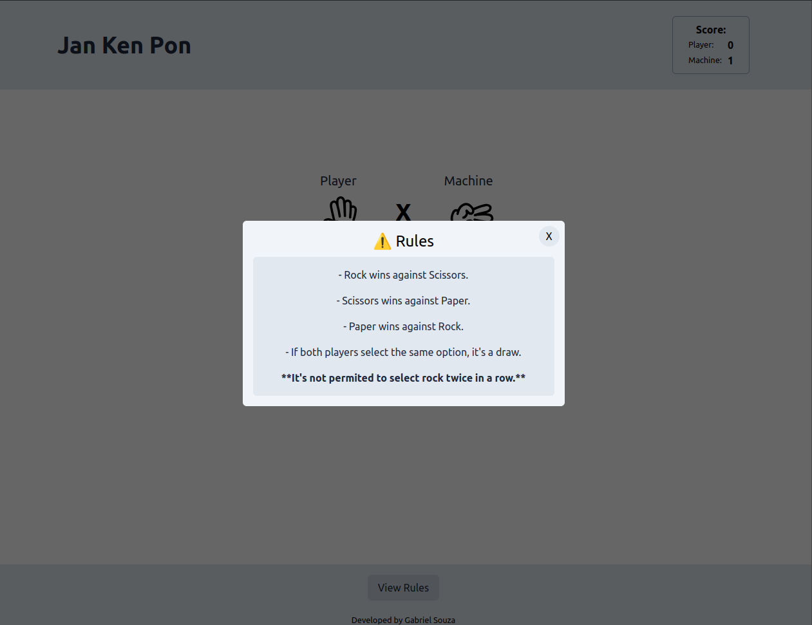

# Rock-Paper-Scissors Game

#### This is a simple implementation of the game "Rock, Paper, Scissors" implemented with the aim of learning and practice, trying to follow a development pattern.

## 🚀 Technologies used:

- **React**: Library to create user interfaces
- **ViteJs**: Build tool for modern web development with blazing fast cold server start
- **Typescript**: Superset of Javascript, with static types for better development experience
- **TailwindCss**: Utility-first CSS framework for quickly building custom designs

#### Related to developer experience:

- **husky**: Git hooks made easy, to run scripts on pre-commit, pre-push, and other git lifecycle events.
- **commitlint**: Lint commit messages to ensure they meet conventional commit format.
- **lint-staged**: Run linters on staged files in git, to ensure code quality before committing.
- **prettier:** Opinionated code formatter to maintain consistent code style across the project.

## 📷 Image preview

- Play:
  

- Game:
  

- Rules:
  

## ⚙️ Installation and Running

To install and run the Rock-Paper-Scissors game locally, follow these steps:

1. Clone the repository:

```bash
  git clone https://github.com/SouzaGabriel26/Rock-Paper-Scissors.git
```

2. Navigate into project directory:

```bash
  cd rock-paper-scissors
```

3. Install dependencies:

```bash
  yarn add
```

4. Start the development server

```bash
  yarn dev
```

5. Open your browser and visit [http://localhost:5173](http://localhost:5173)

## Project status

It's almost deployed...

## 📑 License

This project is licensed under the [MIT License](https://opensource.org/licenses/MIT). Feel free to use and modify this project for your own purposes. If you would like to contribute or report issues, please open a pull request or submit an issue on GitHub.
